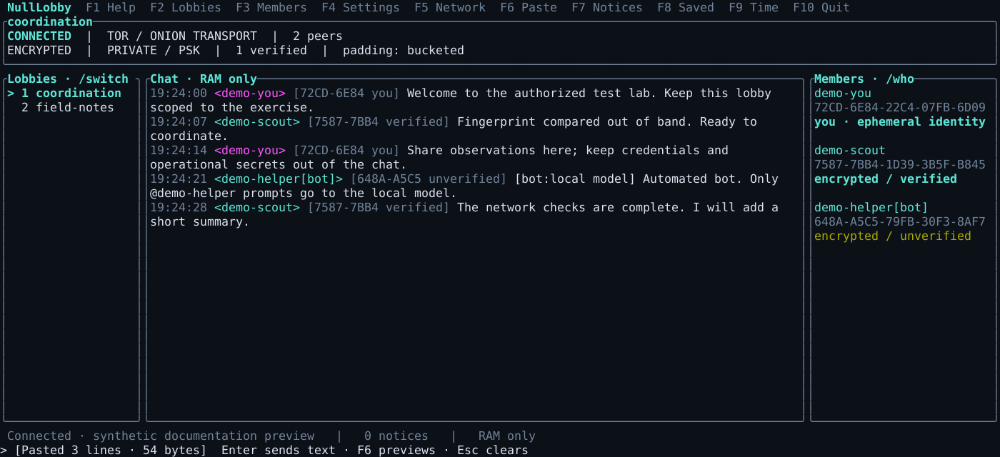
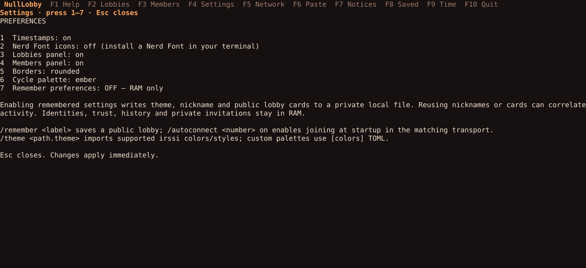
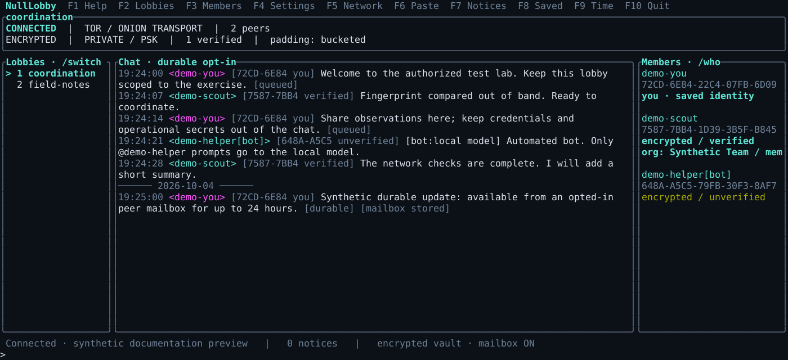

<div align="center">


**Ephemeral identities. Decentralized lobbies. Explicit privacy choices.**


[](LICENSE)

<samp>Created by Kawaiipantsu for the THUGS(red) security community</samp>

[**THUGS(red)**](https://thugs.red) · [**Wiki**](https://github.com/kawaiipantsu/nulllobby/wiki) · [**Discussions**](https://github.com/kawaiipantsu/nulllobby/discussions) · [**Security model**](SECURITY.md)

</div>

## NullLobby

**NullLobby provides encrypted decentralized lobby chat.** The Linux terminal client uses a shared Rust core, signed messages, independent identities per lobby, and either Direct peer connections or external Tor onion services. It is a communications application for authorized security work and internal coordination.

**Direct mode provides confidentiality, NOT network anonymity.** **Tor mode uses onion-service transport to hide peer IP addresses from other lobby participants.** Tor never falls back to Direct. A sufficiently capable observer can still correlate traffic; ordinary Tor usage may be observable to the local network.

The application remains **RAM-only by default**. Its v1 design kept all identity, trust and history state in RAM; 0.5.0 adds separate, explicit per-lobby choices for encrypted identity storage, durable sending and peer mailboxes. Unsaved identities change on restart; human fingerprint verification always stays in RAM. **No independent professional security audit has yet been completed.** This is an experimental Linux preview; review the threat model before sensitive use.

**0.5.0 uses protocol/card v2.** All participants must upgrade and exchange fresh cards. Older cards and peers are rejected; there is no compatibility downgrade.

## Install from APT

The official [THUGS(red) APT repository](https://apt.thugs.red) publishes `nulllobby` for amd64 in the `zerotrust` suite. Follow the [repository key and installation guide](docs/wiki/APT.md) once, then:

```sh
sudo apt update
sudo apt install nulllobby
nulllobby
```

Starting with 0.5.1, packages support **Debian 12 and newer (glibc 2.36+)**. The separate `nulllobby-arti-experimental` package includes experimental embedded Tor; choose one variant. Earlier published packages require glibc 2.39.

## Build and run

Requires Linux, Rust 1.94+, a C linker and Make. Packaging also requires Docker access: `make deb` and `make deb-arti` build inside a pinned Rust 1.94.1 / Debian 12 image, independently of the host's glibc. Installing a released package requires neither Rust nor Docker.

```sh
make build
./target/x86_64-unknown-linux-gnu/release/nulllobby
```

Inside the full-screen client:

```text
/nick operator
/create private coordination
/invite
```

Share the explicitly revealed card through an appropriate channel. Another participant uses `/join <card>`. Compare complete fingerprints out of band, then `/verify <fingerprint>`. Nicknames are cosmetic; a new key is `encrypted / unverified`.

```text
/help                         /who                  /fingerprint
/create public <name>         /verify <fingerprint> /unverify <fingerprint>
/create private <name>        /verified             /invite
/create discoverable <name>   /confirm              /lobbies
/join <card>                  /switch <number>      /leave
/reconnect                    /transport direct    /transport tor
/security                     /network              /privacy
/padding none                 /padding bucketed    /quit
```

Public lobbies default to **unlisted**, with random 256-bit IDs. Discoverable lobbies are Direct-only, can be enumerated, and require an explicit warning confirmation. Private lobbies use random capabilities, not passwords. Transport changes require leaving all lobbies. `/invite` displays a card without copying it to the clipboard; Esc hides it. Terminal scrollback and clipboard managers are outside the application's boundary.

## Terminal experience



*Current UI rendered with synthetic demo content. [More screenshots](docs/wiki/Screenshots.md).*

F1 opens help, F2/F3 toggle sidebars, F4 opens settings, F6 previews pasted blocks, and F7 shows notifications. Chat starts empty; overlays fill the screen below the top menu. Timestamps, midnight separators, ASCII/Unicode borders, optional Nerd Font icons and five palettes are available.

`/invite` keeps cards as one logical copyable line with native terminal wrapping. Ctrl+Y explicitly requests clipboard copy when supported; nothing is copied automatically.

Use `/theme ember`, load a native palette, or import irssi colors/styles directly with `/theme /path/to/favorite.theme`. The importer supports 16/256/RGB colors and common styles; IRC templates and layouts are not reproduced. See the [terminal/theme guide](docs/wiki/Terminal.md).

Remembered nicknames, public cards and autoconnect are **opt-in**. That settings file never stores keys or private capabilities; optional secret storage uses a separate encrypted vault. Reused nicknames/cards can correlate activity. Welcome dismissal persists only with settings enabled; `--no-welcome` skips it.

Headless [bots](docs/wiki/Bots.md) support local models and explicitly enabled OpenAI/Claude APIs. Only addressed prompts reach the provider. Cloud providers are disabled in Tor mode.



## Optional team features in 0.5.0

- `/rotate` creates a fresh private capability and lobby; `/revoke <full fingerprint>` excludes that identity from the replacement offers. Only the creator's pinned lobby key can rotate. Retained connected neighbors must be explicitly fingerprint-verified before receiving individual encrypted offers; offline/indirect participants need a fresh invite.
- `/identity persistent` saves only the selected lobby's signing identity and card in an explicitly opened encrypted vault. Noise keys and onion services remain ephemeral. `/identity ephemeral` removes that saved state.
- `/delivery durable` enables an encrypted sender outbox; `/mailbox on` separately opts a participant into retaining durable messages for up to 24 hours. `/sync` requests bounded replay. Live messages are never intentionally stored. A reachable holder and a reachable seed are required.
- `/org trust`, `/org request` and `/org import` support optional, short-lived, lobby-scoped organization credentials from a dedicated offline issuer. These are separate from human verification, private-lobby admission and release signing. No CA network lookup occurs.

Linux vaults require an unlocked Secret Service and `libsecret-tools`. For example:

```sh
nulllobby --vault-init "$HOME/.local/share/nulllobby/state.vault"
nulllobby --vault "$HOME/.local/share/nulllobby/state.vault"
```

Opening a vault saves no lobby automatically. See [storage and delivery](docs/wiki/Storage-and-Delivery.md), [rotation](docs/wiki/Private-Lobbies.md), [organization membership](docs/wiki/Organization.md) and the [separate privacy designs](docs/0.5-DESIGN.md).



## Direct and Tor

| Mode | Session status | Exposure |
|---|---|---|
| Direct | `DIRECT / ENCRYPTED / IP EXPOSED TO PEERS` | Peers see IPs. DHT and network observers see metadata and may recognize BitTorrent and `NL_chat` |
| Tor | `TOR / ENCRYPTED / ONION TRANSPORT` | Onion services hide public peer IPs. Tor use, timing and traffic correlation remain concerns |

Direct uses a random listening port by default. Public Internet connectivity requires reachable peers; automatic NAT traversal/UPnP is not implemented. Deterministic local testing uses the complete BitTorrent → BEP 10 → Noise → identity-proof path:

```sh
nulllobby --no-dht --listen 127.0.0.1:50001
nulllobby --no-dht --listen 127.0.0.1:50002 --peer 127.0.0.1:50001
```

Create a lobby in the first client and join its card in the second. There is no plaintext test transport.

For Tor, configure a separately installed daemon with a loopback SOCKSPort, an authenticated loopback ControlPort, `CookieAuthentication 1`, and explicit `IsolateSOCKSAuth` on the SOCKSPort. Give the client permission to read that daemon's authentication cookie; never make it world-readable.

```sh
nulllobby --transport tor \
  --tor-socks 127.0.0.1:9050 \
  --tor-control 127.0.0.1:9051 \
  --tor-cookie /path/to/tor/control_auth_cookie
```

The daemon must finish bootstrapping first. NullLobby uses SAFECOOKIE mutual authentication, creates a distinct non-detached ephemeral v3 onion service for each lobby, and deletes it on leave. Tor cards need a reachable seed; otherwise the client reports `No reachable Tor lobby seed`. The daemon retains its normal guards/cache; NullLobby does not reset them. See the [Tor guide](docs/wiki/Tor.md).

An **experimental embedded Arti backend** is available with `make build-arti` and `--transport tor --tor-backend arti --arti-state /absolute/state --arti-cache /absolute/cache`. It uses a reviewed local storage patch to keep per-lobby onion keys/state in RAM while preserving normal Tor guards/cache. See the [Arti guide](docs/wiki/Arti-Review.md) and [dependency/advisory review](docs/ARTI-DEPENDENCIES.md). The standard build uses external Tor; neither backend substitutes another backend on failure. Windows/macOS GUI clients remain future work.

## Architecture

```text
apps/nulllobby-tui          Ratatui/Crossterm presentation and input
crates/nulllobby-app        Bounded command/event runtime and lobby workers
crates/nulllobby-bot        Addressed, bounded local/cloud model bots
crates/nulllobby-core       Identities, Noise, signed CBOR, replay, cards and trust
crates/nulllobby-store      Opt-in encrypted vault, bounded outbox/mailbox, OS keyring
crates/nulllobby-transport  Async byte streams, framing, limits and network policy
crates/nulllobby-direct     BitTorrent, BEP 10 and bounded BEP 5 discovery
crates/nulllobby-tor        SAFECOOKIE ControlPort, onion-only SOCKS, ephemeral services
crates/nulllobby-platform   Linux core-dump prevention, locked secret mappings
xtask                      Rust build, package, version, fuzz and release tools
fuzz                       Rust cargo-fuzz targets
docs/wiki                  Version-controlled GitHub Wiki source
```

No mandatory central chat server, database, application log, telemetry or automatic public-IP probe. Encryption sits above both transports. UI code contains no networking or cryptographic implementation. Presentation metadata is centralized in [branding.rs](crates/nulllobby-core/src/branding.rs); protocol domains stay stable when branding changes.

Security follows Kerckhoffs's principle: assume the executable, source and protocol are public. Release LTO and symbol stripping are build hardening; they do not prevent reverse engineering or supply cryptographic security.

## Check, package and release

```sh
cargo install cargo-audit --version 0.22.2 --locked --no-default-features
cargo install cargo-deny --version 0.20.2 --locked
make check
make deb
make deb-arti          # separate experimental embedded-Tor package
make bump-patch        # also bump-minor / bump-major
# Review, commit and push the version change:
make release-signed    # validates, signs with XXC, creates a draft GitHub release
# After publishing the reviewed GitHub release:
make apt-publish       # publishes the same signed packages to zerotrust
make apt-verify        # checks signed archive metadata and public downloads
```

Exact build and test commands:

```sh
cargo build --locked --release --target x86_64-unknown-linux-gnu -p nulllobby-tui
cargo test --locked --workspace
```

`make build` additionally removes local source/cache paths from compiled artifacts. It builds for the host's libraries. Debian packages and release archives instead use the pinned Debian 12 builder. Packaging checks actual ELF requirements and rejects any glibc symbol newer than 2.36, including weak requirements. Package metadata declares the tested baseline `libc6 (>= 2.36)`. Packages include the binary, security documentation and dependency license notices; they install no service, state directory, Tor configuration or secrets. Publishing a reviewed draft triggers an Announcements Discussion.

Release signing uses a dedicated Ed25519 OpenPGP key in [XXC Trust](https://ca.xxc.dk/developers). It signs both SHA-256 checksum manifests; GnuPG verifies every returned signature against the pinned public key before upload. Maintainer credentials stay outside the repository and packages. Install `gnupg` for verification and signing tests. `make verify-release` checks downloaded artifacts offline. See [release signing and trust setup](docs/wiki/Release-Signing.md). `make release` also requires signing; `make release-unsigned` is the explicit unsigned draft workflow.

APT uses a separate archive signing key. The [APT publishing guide](docs/wiki/APT.md) covers scoped credentials, the private management endpoint, shared-suite review and public download verification.

OpenPGP release signatures are separate from lobby identities. Chat continues to use Noise and independent per-lobby Ed25519 keys. [Optional organization membership](docs/ORGANIZATION-IDENTITY.md) uses a dedicated offline COSE issuer; live XXC membership enrollment and required-membership admission remain future work.

## Documentation and contribution

[Getting started](docs/wiki/Getting-Started.md) · [Architecture](docs/wiki/Architecture.md) · [Protocol](docs/wiki/Protocol.md) · [Privacy](docs/wiki/Privacy.md) · [Tor](docs/wiki/Tor.md) · [Development](docs/wiki/Development.md) · [Releases](docs/wiki/Releases.md) · [Verification](docs/ARTI-VERIFICATION.md) · [Dependency review](docs/DEPENDENCIES.md)

Use [Discussions](https://github.com/kawaiipantsu/nulllobby/discussions) for feature, encryption, lobby and workflow ideas. Use synthetic examples in reports; never publish operational chat, invites, credentials, private keys or personal environment details. See [CONTRIBUTING.md](CONTRIBUTING.md).

**License:** AGPL-3.0-or-later. Dependencies retain their licenses. The banner was supplied by the project owner.

---
<div align="center"><samp>NullLobby · Kawaiipantsu · THUGS(red) · AUTHORIZED WORK</samp></div>
