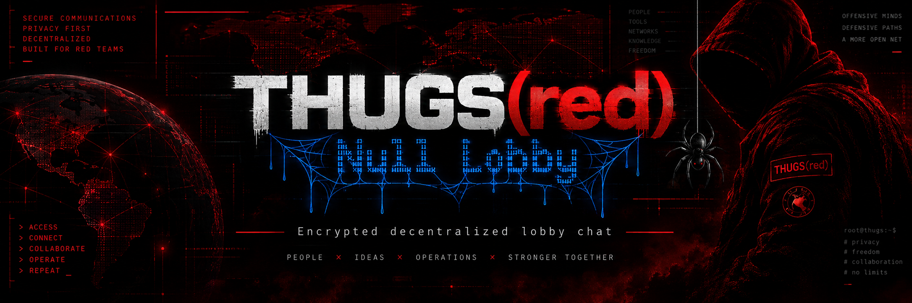

<div align="center">



**Ephemeral identities. Decentralized lobbies. Explicit privacy choices.**


[](LICENSE)

<samp>Created by Kawaiipantsu for the THUGS(red) security community</samp>

[**THUGS(red)**](https://thugs.red) · [**Wiki**](https://github.com/kawaiipantsu/nulllobby/wiki) · [**Discussions**](https://github.com/kawaiipantsu/nulllobby/discussions) · [**Security model**](SECURITY.md)

</div>

## Current status

**Phase 1 is an offline foundation, not a usable chat client.** The packaged `nulllobby` executable runs diagnostics only. No messaging, Noise sessions, BEP 10 negotiation, DHT, Tor, TUI or desktop GUI is implemented. Do not use this release for sensitive communications.

Planned product: **NullLobby provides encrypted decentralized lobby chat.** It is a communications application for authorized security work and internal coordination, not an exploitation framework.

The application is **RAM-first/RAM-only for its own identity, trust and history state in v1**. Identities and verification disappear at process exit. A restart produces new fingerprints. **No independent professional security audit has yet been completed.**

## Contents

- [Build and check](#build-and-check)
- [Implemented foundations](#implemented-foundations)
- [Transport privacy](#transport-privacy)
- [Architecture](#architecture)
- [Packages and releases](#packages-and-releases)
- [Documentation](#documentation)
- [Contribute](#contribute)

## Build and check

Linux `x86_64-unknown-linux-gnu`; Rust 1.94 or later, a C linker and Make. Debian packaging also needs `dpkg-deb`, `readelf` and GNU `tar`. Toolchain installation is outside the application.

```sh
make build
./target/x86_64-unknown-linux-gnu/release/nulllobby --about
./target/x86_64-unknown-linux-gnu/release/nulllobby --security
make test
```

Install the security checking tools once, then run every gate:

```sh
cargo install cargo-audit --version 0.22.2 --locked --no-default-features
cargo install cargo-deny --version 0.20.2 --locked
make check
```

Exact native build and test commands:

```sh
cargo build --locked --release --target x86_64-unknown-linux-gnu -p nulllobby-cli
cargo test --locked --workspace
```

`make build` adds path remapping to avoid embedding local source/cache paths. Release builds use fat LTO, symbol stripping, checked overflow and aborting panics. These are build hardening measures; they do not supply cryptographic security or prevent reverse engineering.

## Implemented foundations

| Area | Phase 1 behavior |
|---|---|
| Identity | Independent OS-generated Ed25519 seed per lobby; full SHA-256 fingerprints |
| Private lobby | Random 256-bit capability; separate HKDF-SHA-256 labels for lobby ID, discovery and future Noise PSK |
| Public lobby | Random 256-bit unlisted ID; no name-based enumeration mechanism |
| Cards | Versioned binary/base64url encoding, SHA-256 checksum, bounded seeds, strict mode/type validation |
| Secret memory | `secrecy` + `zeroize`; Linux dedicated mappings and honest `mlock` status |
| Process | Linux core-dump prevention; panic output excludes payload and location |
| Direct codec | Exact 68-byte BitTorrent handshake, random peer ID, extension-bit/swarm validation |
| App boundary | Socket-free async transport trait, bounded channels, validated text, scoped and bounded trust |

Noise static material is a **placeholder type**, not an X25519 implementation or established Noise session. The Direct parser sets/checks the extension bit; it does not negotiate BEP 10 or open a socket. Tor endpoint types reserve room for future per-lobby services; they do not create services.

## Transport privacy

The following properties describe the planned clients:

| Mode | Intended status | Exposure |
|---|---|---|
| Direct | `DIRECT / ENCRYPTED / IP EXPOSED TO PEERS` | Peers see IPs; DHT and network observers see discovery/BitTorrent metadata and may recognize `NL_chat` |
| Tor | `TOR / ENCRYPTED / ONION TRANSPORT` | Onion services hide peer public IPs from other lobby participants; Tor use and traffic correlation remain concerns |

**Direct mode provides confidentiality, NOT network anonymity.** **Tor mode uses onion-service transport to hide peer IP addresses from other lobby participants.** Both modes will require Noise independently of routing. Tor must fail closed, with no Direct/DHT/DNS fallback. Full backend integration tests belong to Phases 6–7; Phase 1 tests the mode policy only.

Public unlisted IDs are rendezvous identifiers, not secrets or proof of personal identity. Private invites are bearer capabilities. Nicknames are cosmetic. Fingerprints require out-of-band verification and trust stays within one lobby.

## Architecture

```text
apps/nulllobby-cli       Offline diagnostics (temporary Phase 1 app)
crates/nulllobby-core    Domain, identities, KDF, cards, trust, text validation
crates/nulllobby-transport
                        Async byte streams, endpoint types, mode policy, bounded channels
crates/nulllobby-direct  BitTorrent handshake codec only
crates/nulllobby-platform
                        Linux FFI, secret storage, process hardening
xtask                   Rust build/package/version/release tooling
docs/wiki               Version-controlled GitHub Wiki source
docs/discussions        Community discussion source
```

Later: `nulllobby-tor`, Ratatui/Crossterm Linux TUI, and an Iced Windows/macOS app using the same core. UI code will contain no network or crypto implementations. There is no mandatory central chat service.

Presentation metadata lives in [`branding.rs`](crates/nulllobby-core/src/branding.rs). See the [rename guide](docs/wiki/Architecture.md#renaming) before changing crate names or protocol identifiers. Security follows Kerckhoffs's principle: assume the executable, source and protocol are public.

## Packages and releases

```sh
make deb              # dist/nulllobby_0.1.0_amd64.deb + Linux archive + SHA256SUMS
make bump-patch       # or bump-minor / bump-major; changes workspace and lockfile
# Review, commit and push the version change, then:
make release          # checks everything and creates a GitHub draft release
```

Debian packages contain the diagnostic binary, security documentation and dependency license notices. They install no daemon, state directory, Tor configuration or application secrets. A package built on a newer glibc may require a newer distribution; dependencies are derived from the actual ELF binary. Build on the oldest distribution you intend to support.

Publish the draft in GitHub after reviewing it. The release workflow then posts an Announcements Discussion. [Release guide](docs/wiki/Releases.md).

## Documentation

| Guide | Contents |
|---|---|
| [Getting started](docs/wiki/Getting-Started.md) | Build, diagnostics, packages, troubleshooting |
| [Architecture](docs/wiki/Architecture.md) | Crate boundaries, ownership, future clients, renaming |
| [Protocol](docs/wiki/Protocol.md) | Exact Phase 1 card, KDF, fingerprint and handshake formats |
| [Privacy](docs/wiki/Privacy.md) | Direct, Tor, VPN, ephemeral state and limitations |
| [Development](docs/wiki/Development.md) | Tests, limits, dependencies, review expectations |
| [Roadmap](docs/wiki/Roadmap.md) | Phases, next phase and future commands |
| [Releases](docs/wiki/Releases.md) | Version bumps, packaging and Discussion notifications |
| [Dependency review](docs/DEPENDENCIES.md) | Selected versions, upstreams, RustSec and feature review |
| [Security](SECURITY.md) | Threat matrices, implemented guarantees and deferred checks |

## Contribute

Use [Discussions](https://github.com/kawaiipantsu/nulllobby/discussions) for feature, lobby and protocol ideas. Include synthetic examples in bug reports. Do not publish private invites, real chat contents, control credentials, private keys or personal environment details. See [CONTRIBUTING.md](CONTRIBUTING.md).

**License:** AGPL-3.0-or-later. Third-party dependencies retain their licenses. The banner was supplied by the project owner.

---

<div align="center"><samp>NullLobby · Kawaiipantsu · THUGS(red) · AUTHORIZED WORK</samp></div>
